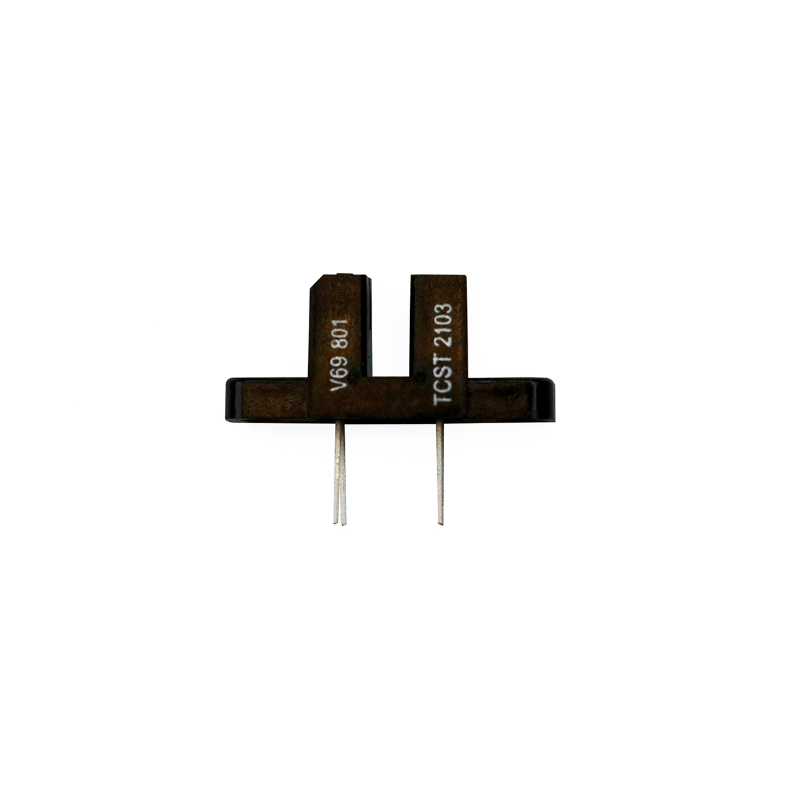

---
title: "Lichtschranke"
date: "2018-10-01T13:28:21.000Z"
tags: 
  - "sensor"
coverImage: "14_lichtschranke.jpg"
material_number: "14"
material_type: "sensor"
material_short_descr: "Gabel-Lichtschranke TCST 2103 Vishay"
manufacture: "VISCHAY"
manufacture_url: "https://www.vishay.com/"
repo_name: "mks-VISHAY-TCST_2103"
product_url: "https://www.vishay.com/en/product/81147/"
clone_url: "https://github.com/Make-Your-School/mks-VISHAY-TCST_2103.git"
repo_prefix: "mks"
repo_part: "TCST_2103"
embedded_example_file: "examples/TCST_2103_minimal/TCST_2103_minimal.ino"
---

# Lichtschranke

## Beschreibung
Die Gabellichtschranke funktioniert wie eine klassische Lichtschranke in einer kompakten Bauweise. Das Modul erkennt, sobald die Lichtschranke zwischen den zwei integrierten Dioden durch einen lichtundurchlässigen Gegenstand unterbrochen wird.

Die Lichtschranke kommuniziert über einen \[simple\_tooltip content='Digital vs. analog:

- Analoge Signale können beliebige kontinuierliche Werte annehmen. Sie verändern sich stufenlos. Dadurch können theoretisch unendlich viele kleine Änderungen (und damit ein unendlicher Informationsinhalt) übertragen werden. Einschränkend wirkt die Genauigkeit, mit der das analoge Signal ausgelesen/erfasst wird.
- Das digitale Signal nimmt nur diskrete Werte an und springt bei einer etwaigen Änderung von einem Wert zum nächsten. Es kann nur eine definierte Anzahl an Informationsinhalten übertragen werden. Vorteilhaft ist dagegen die damit verbundene Fehlerfreiheit bei minimalsten, ungewollten Schwankungen. Oftmals werden nur zwei Werte HIGH und LOW (Ein/Aus oder 1/0) übermittelt.

'\]digitalen\[/simple\_tooltip\] \[simple\_tooltip content='Die Mikrocontroller besitzen kleine metallische Kontakte, an die Komponenten, Shields oder andere Platinen angeschlossen werden können. Diese Kontakte werden Pins genannt und können oft als sogenannte GPIO’s (Allzweck Ein- und Ausgabe) eingesetzt werden. Dies bedeutet, dass diese Pins direkt über die Programmierung des Mikrocontrollers angesprochen werden können und hierbei sogar bestimmt werden kann, ob dieser Pin als Eingang (beispielsweise zum Auslesen eines Sensors) oder als Ausgang (beispielsweise zur Steuerung eines Motors) genutzt werden kann. Praktisches Beispiel: Wird am Arduino eine LED an Pin 1 angeschlossen, kann im Programm direkt der Pin 1 als „An“ oder „Aus“ definiert werden und damit die LED an- oder ausgeschaltet werden. '\]Pin\[/simple\_tooltip\] und gibt entweder „High” oder „Low” aus, abhängig davon, ob der Lichtstrahl durchgelassen oder unterbrochen wird.

Ein üblicher Anwendungsfall ist ein Rotationssensor. Dabei wird eine drehende Achse mit einer gelöcherten Scheibe versehen, die durch die Lichtschranke dreht. Die Lichtschranke erfasst die einzelnen Löcher der Drehscheibe. Eine zeitgleiche Zeitmessung ermittelt schließlich die Drehgeschwindigkeit.

In welchen Bereichen man eine Lichtschranke einsetzen kann, lässt sich mithilfe von Suchmaschinen herausfinden (durch die Eingabe der Komponentenbezeichnung und dem verwendeten Mikrocontroller).

<!-- infolist -->

<!-- infolists -->
## Wichtige Links für die ersten Schritte:

- [Datenblatt](https://asset.conrad.com/media10/add/160267/c1/-/en/000184250DS01/datenblatt-184250-vishay-gabel-lichtschranke-tcst-2103-tcst-2103-1-st.pdf)

## Projektbeispiele:

- [Funduino - Lichtschranke](https://funduino.de/arduino-lichtschranke)
- [Arduino Projekte - Drehgeschwindigkeitsmessung](https://arduino-projekte.info/drehzahlmesser/)
- [Youtube - Geschwindigkeitsmessung](https://www.youtube.com/watch?v=iMvzBdijVwU)

## Weiterführende Hintergrundinformationen:

- [GPIO - Wikipedia Artikel](https://de.wikipedia.org/wiki/Allzweckeingabe/-ausgabe)

