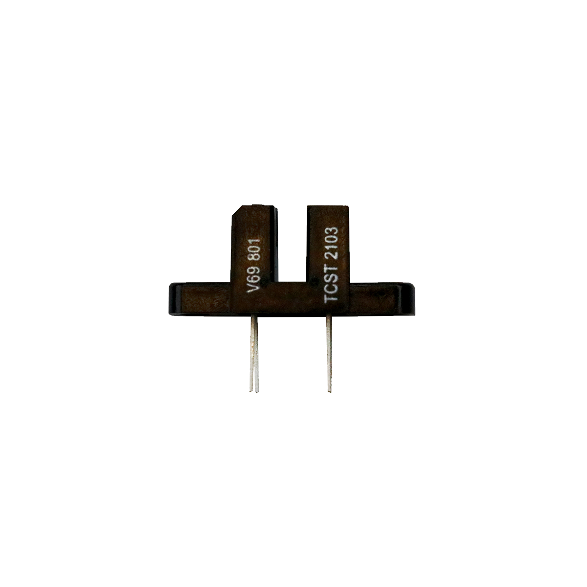

# Lichtschranke

## Beschreibung
Die Gabellichtschranke funktioniert wie eine klassische Lichtschranke in einer kompakten Bauweise. Das Modul erkennt, sobald die Lichtschranke zwischen den zwei integrierten Dioden durch einen lichtundurchlässigen Gegenstand unterbrochen wird.

Die Lichtschranke kommuniziert über einen digitalen Pin und gibt entweder „High” oder „Low” aus, abhängig davon, ob der Lichtstrahl durchgelassen oder unterbrochen wird.

Ein üblicher Anwendungsfall ist ein Rotationssensor. Dabei wird eine drehende Achse mit einer gelöcherten Scheibe versehen, die durch die Lichtschranke dreht. Die Lichtschranke erfasst die einzelnen Löcher der Drehscheibe. Eine zeitgleiche Zeitmessung ermittelt schließlich die Drehgeschwindigkeit.

In welchen Bereichen man eine Lichtschranke einsetzen kann, lässt sich mithilfe von Suchmaschinen herausfinden (durch die Eingabe der Komponentenbezeichnung und dem verwendeten Mikrocontroller).

<!-- infolist -->
## Wichtige Links für die ersten Schritte:

- [Datenblatt](https://asset.conrad.com/media10/add/160267/c1/-/en/000184250DS01/datenblatt-184250-vishay-gabel-lichtschranke-tcst-2103-tcst-2103-1-st.pdf)

## Projektbeispiele:

- [Funduino - Lichtschranke](https://funduino.de/arduino-lichtschranke)
- [Arduino Projekte - Drehgeschwindigkeitsmessung](https://arduino-projekte.info/drehzahlmesser/)
- [Youtube - Geschwindigkeitsmessung](https://www.youtube.com/watch?v=iMvzBdijVwU)

## Weiterführende Hintergrundinformationen:

- [GPIO - Wikipedia Artikel](https://de.wikipedia.org/wiki/Allzweckeingabe/-ausgabe)

